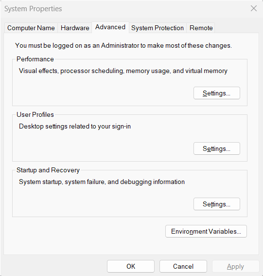
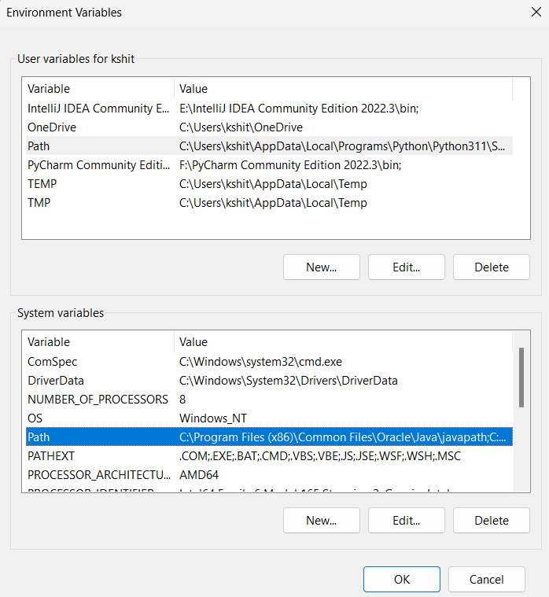
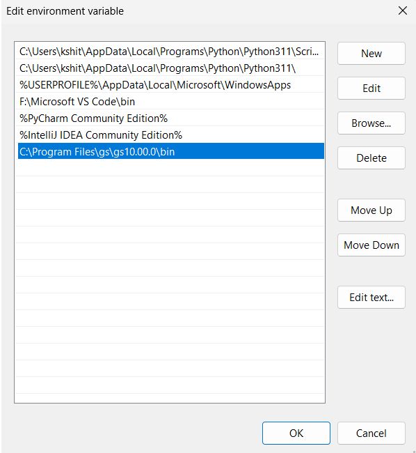

PDF-to-XLSX
============


Foobar is a Python library for dealing with word pluralization.

## Installation
1. Install [ghostscript] (https://www.ghostscript.com/releases/gsdnld.html) to local.

2. Use the pipfile to install necessary packages.
```bash
pipenv install
```

3. Create a .env file for inputting environment variables
```bash
copy env_file .env
```

4. Enter environment variables according to the template `env_file`

## Usage
```bash
pipenv run python ./main.py
```

## Solutions for Errors
### OSError
<details>
<summary>Ghostscript is not installed.</summary>

If getting `OSError: Ghostscript is not installed. You can install it using the instructions here: https://camelot-py.readthedocs.io/en/master/user/install-deps.html although it is installed already`,

1. Copy the path where you have installed ghostscript.

2. If you are using windows - search for "Edit the system environment variable".


3. Above dialog should open. Click on the "environment variable" tab.

4. Under "system variables" section double click "path".


5. Click on the open space and paste the copied path of the ghostscript.


6. Click OK and for precautions restart your device.
</details>

## Contributing

Pull requests are welcome. For major changes, please open an issue first
to discuss what you would like to change.

Please make sure to update tests as appropriate.

## License
>You can check out the full license [here](https://github.com/guyverhl/PDF-to-XLSX/blob/main/LICENSE)

This project is licensed under the terms of the **MIT** license.